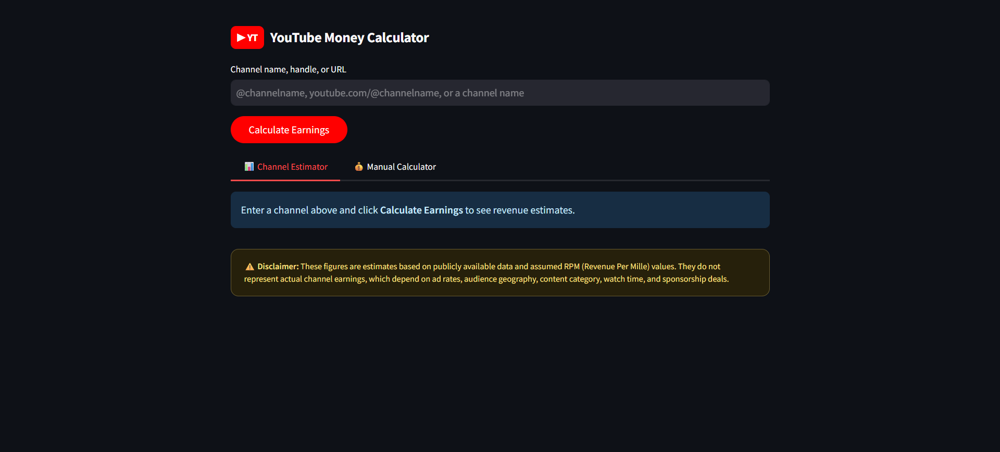
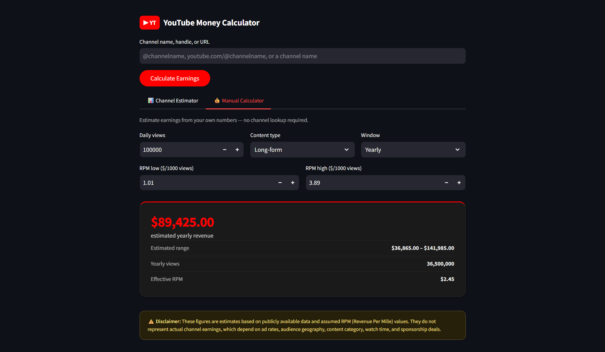
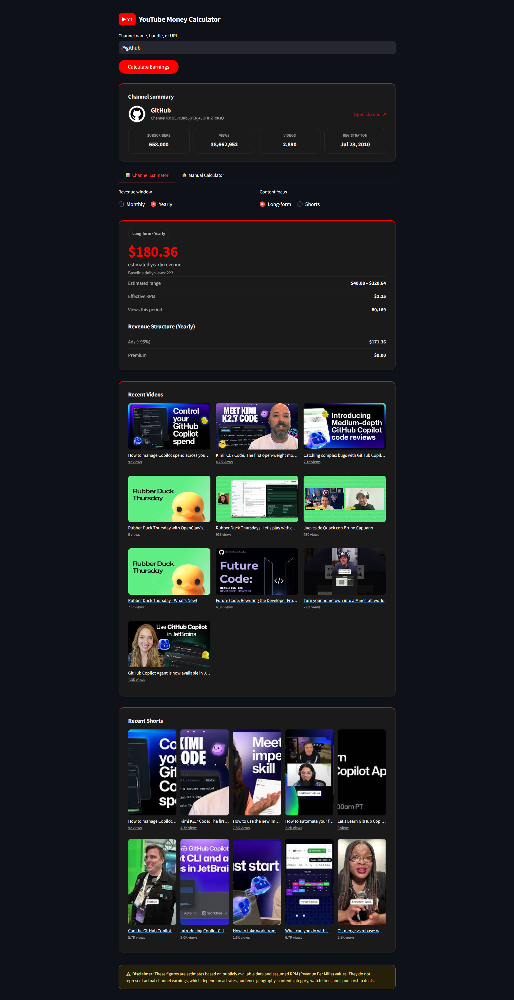

# YouTube Money Calculator 💰

Ever wondered how much your favorite YouTuber actually makes? I built this tool to scratch that itch. It pulls real data from YouTube's API and estimates channel earnings based on RPM (Revenue Per Mille) — basically what creators earn per 1,000 views.

It's not perfect (no public tool is — YouTube doesn't share actual revenue numbers), but it gets pretty close using the same methodology that tools like Social Blade use, except this one's open source and you can tweak the RPM values yourself.

## What it looks like

Here's the dashboard in action:

### Enter Channel name for lookup


### Manual calculator tab


### Channel earnings overview with video & shorts previews with thumbnails


## What it does

- **Look up any YouTube channel** — paste a handle like `@mkbhd`, a full URL, or just search by name
- **Get estimated monthly/yearly earnings** — broken down into low, medium, and high estimates
- **See revenue structure** — how much comes from ads vs YouTube Premium
- **Browse recent videos & Shorts** — with thumbnails, view counts, and direct YouTube links
- **Manual calculator** — plug in your own numbers (daily views, RPM range) to estimate earnings without looking up a channel
- **Dark themed UI** — easy on the eyes, YouTube-branded red accents

## Tech I used

| Layer | What | Why |
|-------|------|-----|
| Backend | FastAPI | Fast, clean, auto-docs at `/docs` |
| Frontend | Streamlit | Quick to build, looks decent out of the box |
| YouTube data | YouTube Data API v3 | Official source, reliable |
| Caching | cachetools (in-memory TTL) | Avoid hammering the API quota |
| Validation | Pydantic | Type safety without boilerplate |
| HTTP | httpx | Modern Python HTTP client |
| Testing | pytest + Hypothesis | Unit tests + property-based testing |

## Getting started

### Prerequisites

- Python 3.12+
- A YouTube Data API v3 key (get one from [Google Cloud Console](https://console.cloud.google.com/apis/library/youtube.googleapis.com))

### Setup

```bash
# Clone it
git clone <your-repo-url>
cd youtube-earnings-estimator

# Install deps
pip install -r requirements.txt

# Set up your API key
cp .env.example .env
# Open .env and paste your YOUTUBE_API_KEY
```

### Run it

You need two terminals — one for the API backend, one for the Streamlit frontend:

**Terminal 1 — API server:**
```bash
uvicorn app.main:app --reload --port 8000
```

**Terminal 2 — Dashboard:**
```bash
streamlit run streamlit_app.py
```

Open `http://localhost:8501` and start looking up channels.

### Docker (alternative)

```bash
docker build -t yt-earnings .
docker run -p 8000:8000 --env-file .env yt-earnings
```

## Configuration

All config goes in `.env`. Only `YOUTUBE_API_KEY` is required — everything else has sane defaults:

| Variable | Default | What it does |
|----------|---------|--------------|
| `YOUTUBE_API_KEY` | — | Your API key (required) |
| `RPM_LOW` | `0.50` | Low-end RPM for long-form content |
| `RPM_HIGH` | `4.00` | High-end RPM for long-form content |
| `API_TIMEOUT_SECONDS` | `10` | How long to wait for YouTube's API |
| `CACHE_CHANNEL_TTL` | `86400` | Channel ID cache (24h) |
| `CACHE_STATS_TTL` | `3600` | Stats cache (1h) |
| `CACHE_VIDEOS_TTL` | `1800` | Video list cache (30min) |
| `CACHE_MAX_SIZE` | `1000` | Max cached entries before LRU kicks in |

## API reference

If you want to hit the backend directly:

```
GET /estimate?q=@mkbhd
```

Returns JSON with channel stats, earnings breakdown, and recent videos. Full docs at `http://localhost:8000/docs` when the server's running.

Quick error codes:
- `404` — channel not found
- `422` — bad input (empty query, invalid RPM)
- `502` — YouTube API is down or timed out

## Running tests

```bash
pytest -v
```

## Disclaimer

These are **estimates**. Actual creator earnings depend on dozens of factors — ad rates, audience geography, content category, sponsorships, memberships, etc. Don't make financial decisions based on this tool. It's for curiosity and fun.

## License

Do whatever you want with it. If you build something cool on top, let me know.
